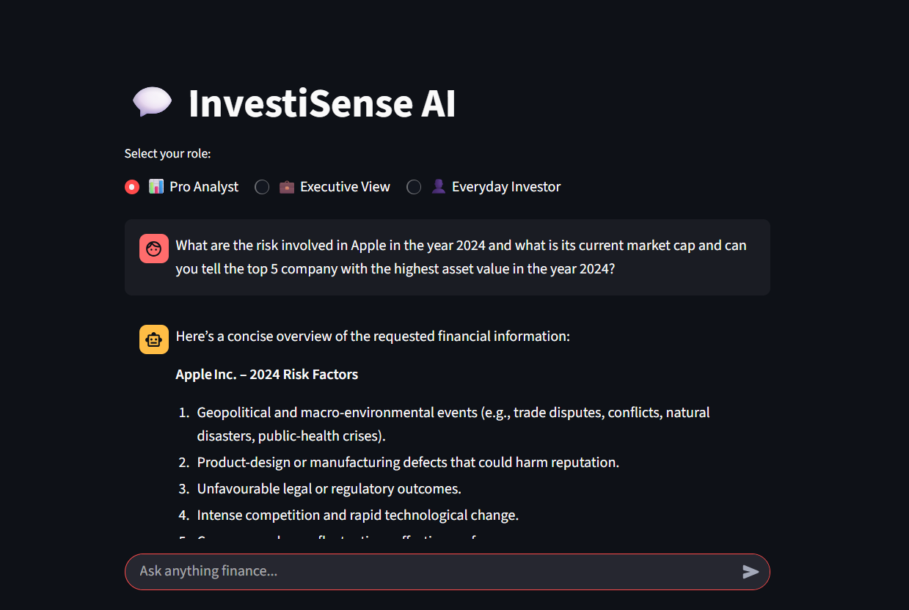

# 🚀 InvestiSense AI

>**InvestiSense-AI** is an intelligent financial assistant that provides real-time insights, analysis, and personalized recommendations for smarter investing.
---

## 📝 Description
**InvestiSense-AI** is an AI-powered financial insights platform designed to simplify investing decisions.  
It combines **real-time market data**, **advanced analytics**, and **natural language understanding** to:  

- Answer user queries in natural language  
- Generate personalized financial insights  
- Assist in portfolio evaluation  

Built with a **FastAPI backend**, **Streamlit interface**, and **external APIs**,  
InvestiSense-AI delivers accurate, user-friendly, and interactive financial intelligence  
tailored for both beginners and experienced investors.
---

## ✨ Features
- 📊 **Stock Market Q&A** — Ask natural language questions about stocks and get instant AI-powered answers.  
- 🔍 **Real-Time Financial Data** — Integrates with live market APIs for up-to-date insights.  
- 🤖 **RAG-Powered Responses** — Combines retrieval and generative AI for accurate, context-rich answers.  
- 📈 **Company & Sector Analysis** — Provides summaries, comparisons, and financial metrics of companies.  
- 🧠 **Smart Investment Insights** — AI-driven reasoning for trends, risks, and opportunities.  
- ⚡ **FastAPI Backend** — High-performance API server for financial data processing.  
- 🌐 **Streamlit Frontend** — Interactive and intuitive dashboard for seamless user experience.
- 📌 **User-Friendly Interface** — Minimal, clean design optimized for quick decision-making.

---

## 🖥️ Demo
<!-- Add a GIF or Screenshot -->


## 🚀 Live Demo
[Try InvestiSense AI here](https://investisense-ai.streamlit.app/) – Fully functional Streamlit UI version (includes all logic internally for deployment purposes).

> Note: The project also has a FastAPI backend that can be run locally.  
> Due to deployment size constraints, the deployed demo uses the backend logic embedded directly into the Streamlit app.


---

## 🏗️ Tech Stack
## 🛠️ Tech Stack

- ⚡ **FastAPI** — High-performance backend for AI-powered responses and API endpoints.  
- 🧠 **LangChain + RAG Pipeline** — Context-aware retrieval and reasoning for financial insights.  
- 🤖 **LLMs (OpenAI / Hugging Face)** — Natural language understanding and generation.  
- 🐍 **Python** — Core programming language for backend, utilities, and AI logic.  
- 📊 **SQLite Databases** — Lightweight numeric databases (`analyst_data.db`, `executive_data.db`, `investor_data.db`) for structured financial data.
- 📈 **yFinance** — Real-time stock price, financials, and historical market data.  
- 🌐 **Streamlit** — Interactive frontend for querying and visualizations. 

---

## 📂 Project Structure
```plaintext
InvestiSense-AI/
└── app/
    ├── backend/
    │   ├── main/
    │   │   ├── __init__.py
    │   │   └── server.py
    │   ├── utils/
    │   │   ├── __init__.py
    │   │   ├── memory.py
    │   │   ├── rag_pipeline.py
    │   │   ├── real_time_data_tool.py
    │   │   ├── replier.py
    │   │   ├── routing_classifier_filter.py
    │   │   └── sql_query_generator.py
    │   └── __init__.py
    ├── frontend/
    │   ├── __init__.py
    │   └── homepage.py
    ├── assets/
    └── database/
        └── numeric_db/
            ├── analyst_data.db
            ├── executive_data.db
            └── investor_data.db

